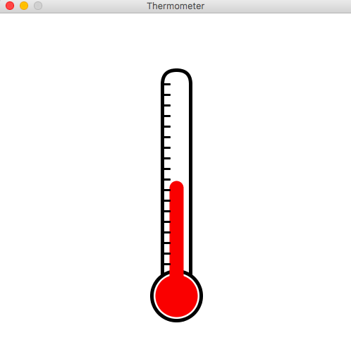
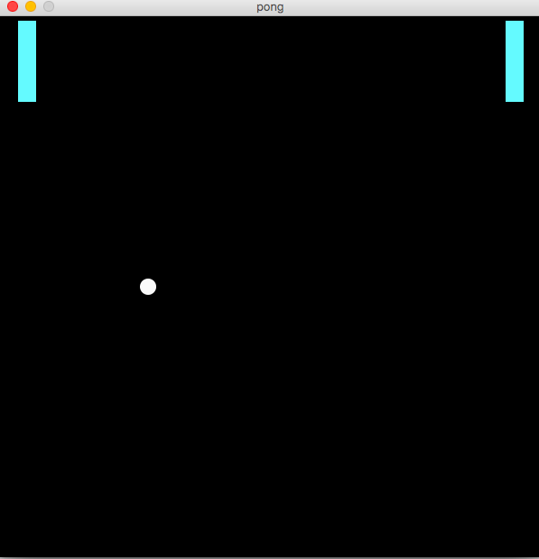
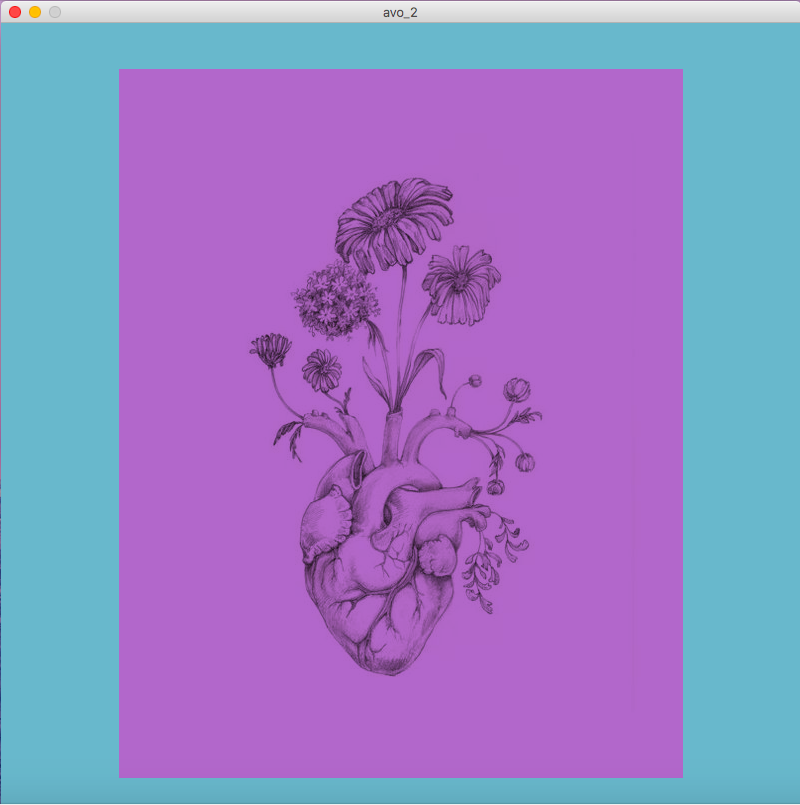

# Sketch Nr. 1: Thermometer
Thermometer, which increases in temperature when the mouse is moved up.

# Sketch Nr. 2: "Pong"
 We tried to recreate the game PONG.
 What is PONG? - There are two player. Spieler1 controles his/her rectangle with UP/LOW. 
 Spieler2 controles his/her rectangle with LEFT/RIGHT
 The ball should colied against the rectangles. If not it dissaperes and comes back 
 so that the game can go on. 

# Sketch Nr. 3: "Fun"
This sketch is all about experimenting with images. By clicking new pictures appear. 

